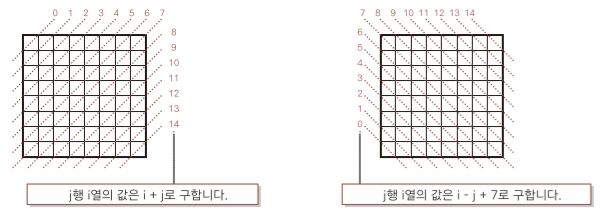

# 8퀸 문제

_8 x 8 체스판에 8개의 퀸을 서로 공격해 잡을 수 없도록 배치하라_

퀸은 자신의 행과 열에 있는 체스말을 공격할 수 있으며 또한 대각선으로도 공격할 수 있다.<br>
따라서 행과 열이 겹치지 않도록 8개의 퀸을 배치해야 하는데 이는 재귀 알고리즘을 이용해 구현할 수 있다.<br>

```set(i)```를 배열 ```pos[i]```에 _j행_ 값을 0부터 7까지의 값을 순서 대로 대입하여 _i열_ 에 퀸을 1개만 배치하는 8가지 조합을 만드는 메서드 라고 할때 먼저 ```set(0)``` 을 호출하고 그 뒤  ```set(i+1)``` 재귀 호출을 한다. <br>

이렇게 가지를 뻗으며 퀸을 배치하는 조합을 모두 나열하는 방법을 **가지 뻗기 (branching)** 라고 한다.<br> 

하노이의 탑이나 8퀸 문제처럼 문제를 세분하고 세분된 작은 문제의 풀이를 결합해 전체 문제를 풀이하는 기법을 _**분할 정복법(divide and conquer)**_ 이라고 하기도 한다.<br>

8퀸 문제를 풀기 위해서는 _**백트래킹(Backtracking)**_ 또는  _**분기 한정법(branching and bounding method)**_ 을 이용해 필요없는 분기 _(같은 열과 행 그리고 양 대각선 방향에 퀸을 놓는 분기)_ 를 생략/없애야 한다. 가능한 배치의 총 수는 92개이다.



```java
static boolean[] row = new boolean[8]; // 퀸이 배치된 행
static boolean[] diag1 = new boolean[15]; // 대각선 방향 '\'
static boolean[] diag2 = new boolean[15]; // 대각선 방향 '/'
static int[] pos = new int[8]; // 8개의 열에 대한 배열

public static void main(String[] args) {
    set(0);
}

static void set(int i) {
    for (int j = 0; j < 8; j++) {

        if (!row[j] && !diag1[i-j+7] && !diag2[i+j]) {
            pos[i] = j;
            if(i == 7) {
                print();
            }else {
                row[j] = diag1[i-j+7] = diag2[i+j] = true;
                set(i+1);
                row[j] = diag1[i-j+7] = diag2[i+j] = false; //재귀 호출이 끝난 뒤에는 나머지 행,대각선 방향들을 모두 false로 바꿔줘야 함
            }
        }

    }
}

static void print() {
    for (int i = 0; i < 8; i++) {
			for (int j = 0; j < 8; j++)
				System.out.printf("%s", j == pos[i] ? "■" : "□");
			System.out.println();
		}
		System.out.println();
}
```