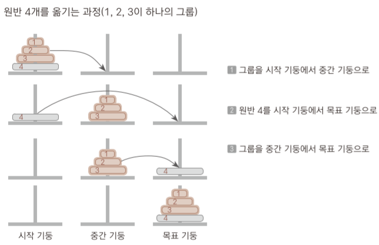
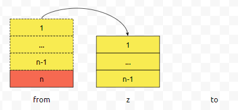
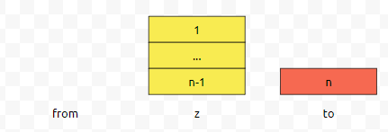
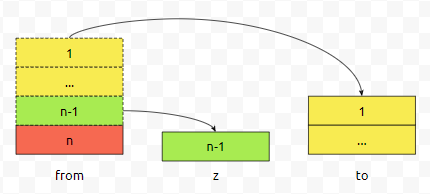
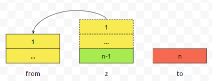
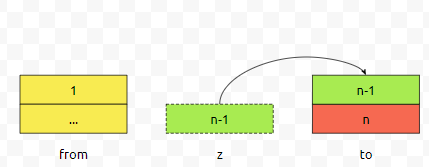

# 하노이의 탑

[참고 출처](https://codingdog.tistory.com/entry/하노이탑-알고리즘-재귀-호출의-대표적인-문제를-구현해-봅시다?category=1055061)

하노이의 탑은 작은 원반이 위에, 큰 원반이 아래에 위치할 수 있도록 원반 을 3개의 기둥 사이에서 옮기는 문제이며 모든 원반은 크기가 다르고 처음에는 모든 원반이 이 규칙에 맞게 첫 번째 기둥에 쌓여 있다. 이 상태에서 모든 원반을 세 번째 기둥으로 _최소의 횟수_ 로 옮겨야 한다.<br>
처음에 원반 n개가 놓인 기둥을 from, 목표 기둥을 to, 경유지 기둥을 z이라고 했을때, 원반 n-1개를 하나의 그룹으로 보고 이 문제를 해결한다.



_최소의 횟수로 옮기기 위해 n번째 원판은 바로 from에서 to로 가야하며, 그전에 n-1개의 원판은 먼저 from에서 경유지 z까지 갔다가, 다시 경유지 z에서 to로 가야 한다._




n-1째 원판이 from에서 경유지 z로 가기 위해서는 n-2개의 원판은 먼저 from에서 경유지 to까지 갔다가, 다시 경유지 to에서 z로 가야한다.<br>
n-1째 원판이 다시 경유지 z에서 to로 가기 위해서는 n-2개의 원판은 먼저 z에서 경유지 from까지 갔다가, 다시 경유지 from에서 to로 가야한다.





코드로 표현하면 다음과 같다.
```c
#include <studio.h>
void hanoi(int from,int z,int to,int n);
int main(void)
{
    int n; scanf("%d",&n);
    hanoi(1,2,3,n);
}
void hanoi(int from,int z,int to, int n)
{
    if(n==0)
        return;
    hanoi(from,to,z,n-1);
    printf("%d : %d -> %d\n",n,from,to); 
    hanoi(z,from,to,n-1);   
}
```

```java
public static void main(String[] args) {
    Scanner stdIn = new Scanner(System.in);
    int n = stdIn.nextInt();

    move(n, 1, 3); // 1기둥에 쌓인 n개를 3기둥에 옮김
}

static void move(int n, int from, int to) {
    if (n > 1)
        move(n - 1, from, 6-from-to); 

    System.out.printf("%d : %d -> %d\n", n, from, to);

    if (n > 1)
        move(n - 1, 6-from-to, to);
}
```